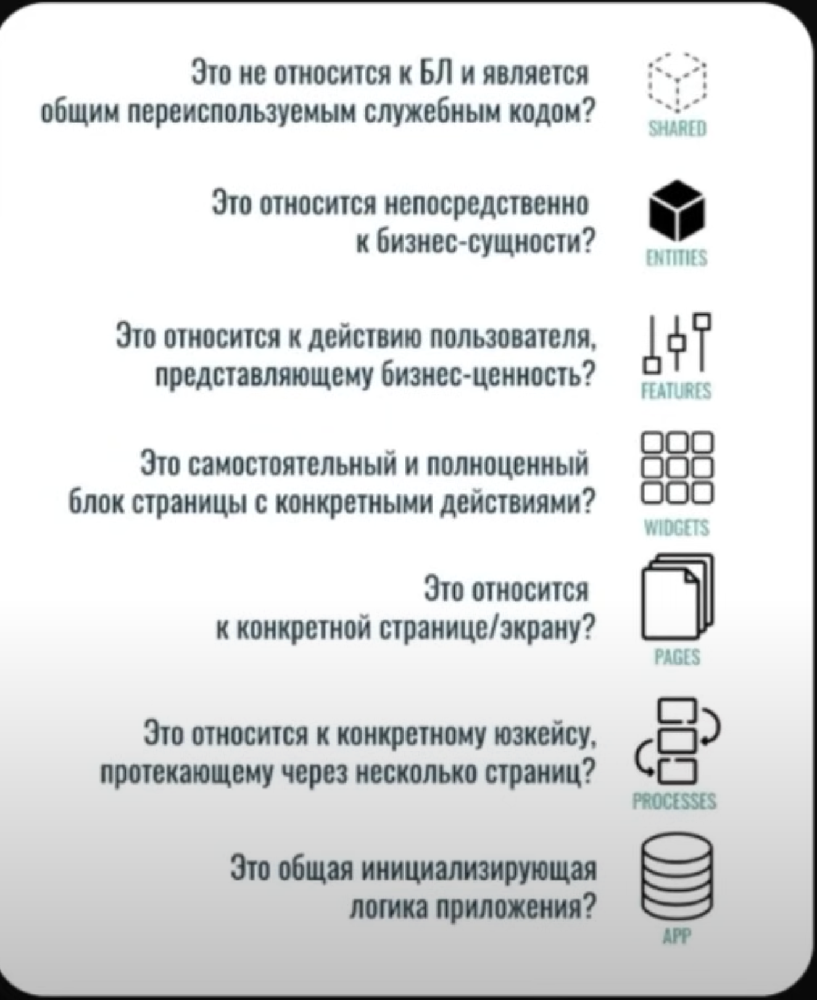

# Structure

## FSD + TanStack + Zustand + Supabase + Tailwind CSS

Feature-Sliced Design [FSD](https://feature-sliced.github.io/documentation/ru/docs/get-started) is a methodology for structuring applications in a way that promotes scalability, maintainability, and collaboration.
It emphasizes the separation of concerns and encourages the use of reusable components and features.
This project follows the FSD methodology, utilizing TanStack for routing and data management, Zustand for state management, Supabase for authentication and product database, and TypeScript for type safety.
Example of Full FSD structure.

```
└── src/
    ├── app/                    # initial logic application
    |                           #
    ├── pages/                  # Layer: pages (router)
    |   ├── {some-page}/        #     Slice: (example: Product page)
    |   |   ├── api/            #         Segment: API logic (api instances,requests, ...)
    |   |   ├── lib/            #         Segment: Infrastructure logic (helpers/utils)
    |   |   ├── model/          #         Segment: Business logic
    |   |   └── ui/             #         Segment: UI logic
    |                           #
    ├── widgets/                # Layer: reusable UI components
    |   ├── {some-widget}/      #     Slice: (example: Sidebar widget)
    |   |   ├── api/            #         Segment: API logic (api instances, requests, ...)
    |   |   ├── lib/            #         Segment: Infrastructure logic (helpers/utils)
    |   |   ├── model/          #         Segment: Business logic ( state management, tests...)
    |   |   └── ui/             #         Segment: UI logic
    ├── features/               #  Layer: reusable business logic features
    |   ├── {some-feature}/     #     Slice: (example: Cart feature)
    |   |   ├── api/            #         Segment: API logic (api instances, requests, ...)
    |   |   ├── lib/            #         Segment: Infrastructure logic (helpers/utils)
    |   |   ├── model/          #         Segment: Business logic  ( state management, tests...)
    |   |   └── ui/             #         Segment: UI logic
    |   ...                     #
    |                           #
    ├── entities/               # Layer: reusable entities
    |   ├── {some-entity}/      #    Slice: (example: Product entity)
    |   |   ├── api/            #         Segment: API logic (api instances, requests, ...)
    |   |   ├── lib/            #         Segment: Infrastructure logic (helpers/utils)
    |   |   ├── model/          #         Segment: Business logic  ( state management, tests...)
    |   |   └── ui/             #         Segment: UI logic
    |   ...                     #
    |                           #
    ├── shared/                 # Layer: reusable shared logic
    |   ├── api/                #         Segment: API logic (supabase api client, ...)
    |   ├── model/              #         Segment: Business logic ( global store ...)
    |   ├── config/             #         Segment: Configuration (env, constants, ...)
    |   ├── lib/                #         Segment: Infrastructure logic (helpers/utils)
    |   └── ui/                 #         Segment: UI logic
    ├── styles/                 # Layer: global styles
    |   ├── global.css          #         Segment: Global styles
    |   ├── tailwind.config.js  #         Segment: Tailwind CSS configuration
    |   └── postcss.config.js   #         Segment: PostCSS configuration
    ├── assets/                 # Layer: static assets
    |   ├── images/             #         Segment: Images
    |   ├── fonts/              #         Segment: Fonts
    ├── public/                 # Layer: public assets
    |   ├── favicon.ico         #         Segment: Favicon
    |   └── robots.txt          #         Segment: Robots.txt
    |   ...                     #
    ├──__tests__/               # Layer: tests
    |   └── e2e/                #         Segment: End-to-end tests
    |   ...                     #
    |                           #
    └── main.tsx                #         Segment: Entry point for the application
    └── index.html              #         Segment: HTML entry point
```


